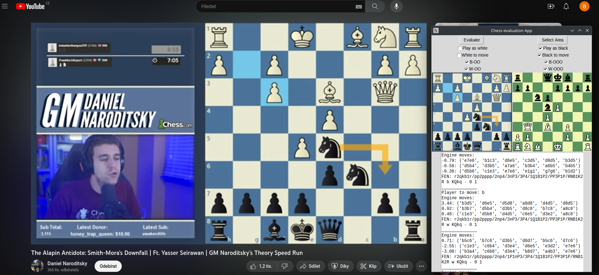

##Short description:
A simple application designed for recognizing "online" chess positions (i.e., corresponding FEN notation) from a screenshot using a small neural network and predicting next best moves, utilizing Stockfish engine. The package includes: An application script, a script for generating training data and a script training of the mentioned network.

###Disclaimer:
The application primarily serves for analyzing live broadcasts and facilitating the easy import of games from videos into an analyzer etc. Secondary purpose is purely educational, as the ability to generate custom data enables easy comparison of the effectiveness of various neural network models, the influence of data augmentation, and similar aspects. Any misuse for cheating during one's own games is immoral and honestly quite stupid.

##Motivation:
During the last few years, the popularity of chess has been rapidly increasing. This is accompanied by a growth in online content, whether it's educational videos, game recordings, or live broadcasts of matches at the highest level.

It is evident that modern chess engines far surpass even the most accomplished human players in terms of their performance. These engines have become indispensable tools for not only game analysis but also for evaluating the current state of a chess position, often quantified using metrics like the "Centipawn metric."

However, particularly in the realm of game streaming, a common scenario unfolds where viewers lack access to real-time position evaluation, let alone the best possible subsequent moves. During these live games, viewers often find themselves in a position where they wish they could see which player has the upper hand, understand the strategic moves necessary to maintain a lead, or even verify the feasibility of their own ideas within a specific game position. Standard chess websites naturally include tools for game analysis; however, setting up a position based on an image is impractical and time-consuming for an average person.

The purpose of this application is thus quite evident: Take a screenshot -> display the best following moves along with evaluations -> for easy position export, also generate the standard FEN notation.

##Requirements:

- **Operating System:** Tested only on a Linux machine (Ubuntu 23.04)
- **Chess engine:** Stockfish + python stockfish api (see [Stockfish on PyPI](https://pypi.org/project/stockfish/))
- **GUI framework:** Tkinter (see [How to Install Tkinter on Linux](https://www.geeksforgeeks.org/how-to-install-tkinter-on-linux/))
- **Python>= 3.11:**
  - tensorflow >= 2.12.0
  - numpy
  - pillow
  - opencv-python
  - stockfish

##Manual
After successful installation (you can use, for example, pip install command), the application itself is launched through the command line using the command "chessrec_app". Optional parameters:

  -  &#45;&#45;master_H": Dimension of the app window (def 540)
  -  &#45;&#45;master_W: Dimension of the app window (def 360)
  -  &#45;&#45;stockfish_elo: Level of the stockfish engine (def 3000)
  -  &#45;&#45;stockfish_depth: Depth of the tree search of the engine (def 16)
  -  &#45;&#45;stockfish_hash: Memory usage (def 2048)
  -  &#45;&#45;stockfish_threads: Number of parallel threads the engine uses(def 4)

Note that if the Stockfish engine is not installed globally, you have to set the correct path to the bin files (see the link in the previous sect.) in the constants.py file.

1. Press the "Select area" button to open a new transparent window. Resize and position this window over the area from which you want to take a screenshot of the chessboard. Edges do not have to be align properly, however too big offsets can downgrade the preformance. However, you can reselect and adjust the selected area whenever you want by pressing the button again.

2. Use the auxiliary buttons to select which player is to move and the chessboard perspective. Additionally, select which castling options are still permissible.

3. Upon clicking the "Evaluate" button, the left portion will display a screenshot of the selected area, while the right side will show the neural network's interpretation of the given position for verification. In the text section, you'll find several best moves along with their centipawn evaluations and line continuation. Below that, you will also see the FEN notation.

Note: The FEN notation, of course, isn't complete, as it's impossible to determine the current move count, repetition history, or en passant possibility solely from an image.

*Example: GM Daniel Naroditsky ([YouTube Link](https://www.youtube.com/watch?v=bFLEuc7G7YA)) explaining his thought process. On the right side of the image, we see the application: Buttons are set for the perspective of the black player, the black player is to move, and all castling options are permissible. The left board is the screenshot, the right one is the reconstruction based on the neural network recognition (hence the default "white" orientation). As you can see, the position was reconstructed correctly in this case. The position's evaluation is displayed in the text box, and each use of the "Evaluate" button is separated by a horizontal line. We can observe that GM Naroditsky briefly considers the third-best move, knight from D5 to B6. (Spoiler) However, he ultimately decides to play e7 to e6, which, as we can see, is by far the top engine move.*

